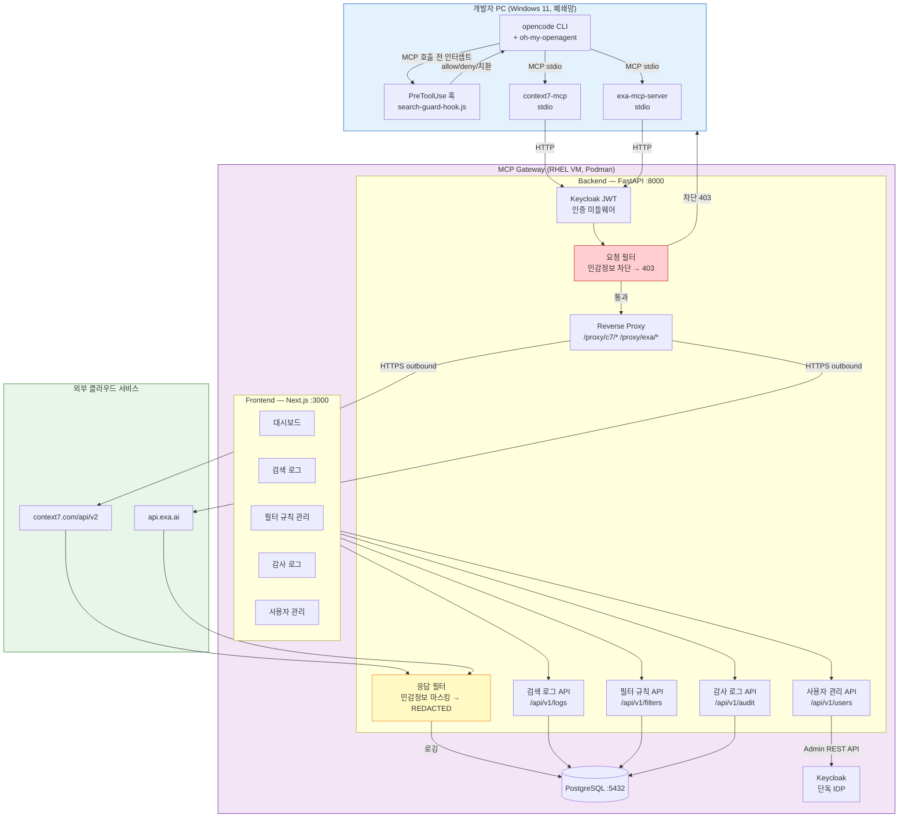

# 시스템 전체 구성도

## 변경사항
- (2026-03-31) 양방향 콘텐츠 필터링, 단독 Keycloak IDP, Frontend 기능 확장
- (2026-04-05) 개발자 PC에 PreToolUse 훅 추가 — 3계층 보안 방어

## 아키텍처 다이어그램



## 컴포넌트 설명

| 컴포넌트 | 역할 | 포트 |
|----------|------|------|
| FastAPI Backend | HTTP Reverse Proxy + 양방향 필터 + REST API | :8000 |
| Next.js Frontend | 보안 담당자 모니터링 포털 | :3000 |
| PostgreSQL | 검색 로그, 필터 규칙, 감사 추적 | :5432 |
| Keycloak | 단독 IDP — 사용자 인증/관리 | :8080 |

## 환경 설정 (개발자 PC)

```json
{
  "mcpServers": {
    "context7": {
      "env": { "CONTEXT7_API_URL": "http://gateway:8000/proxy/c7" }
    },
    "exa": {
      "env": { "EXA_BASE_URL": "http://gateway:8000/proxy/exa" }
    }
  }
}
```
