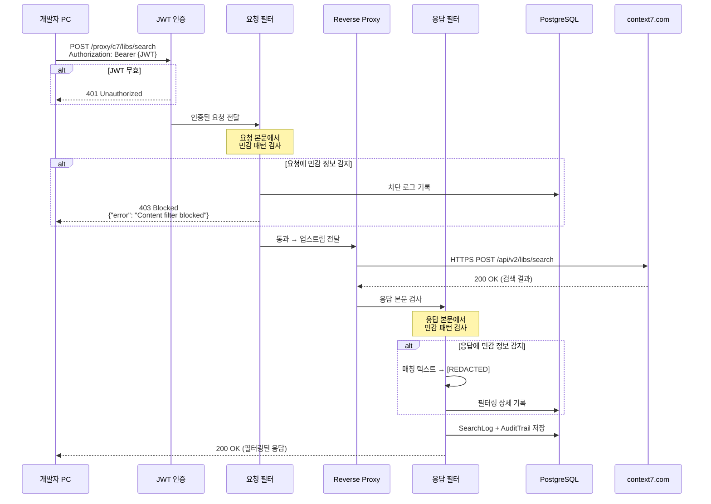
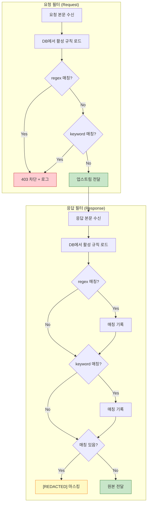

# 양방향 필터링 요청 흐름

## 변경사항
- **기존**: 응답(response)만 필터링
- **변경**: 요청(request) + 응답(response) 양방향 필터링
- 요청에 민감 정보 포함 시 **403 차단** (업스트림 전달하지 않음)
- 응답에 민감 정보 포함 시 **[REDACTED] 마스킹** 후 전달

## 요청 흐름

## 필터 파이프라인 상세

## 필터 규칙 예시

| 이름 | 유형 | 패턴 | 방향 | 동작 |
|------|------|------|------|------|
| 주민등록번호 | regex | `\d{6}-[1-4]\d{6}` | both | 요청: 차단, 응답: 마스킹 |
| IP 주소 | regex | `\d{1,3}\.\d{1,3}\.\d{1,3}\.\d{1,3}` | response | 응답만 마스킹 |
| 민감 키워드 | keyword | `credential,private_key,비밀번호,passwd` | both | 요청: 차단, 응답: 마스킹 |
| 자격증명 할당문 | regex | `(?i)(?:password\|token\|secret\|api_key)\s*[=:]\s*\S+` | both | 값 할당 패턴만 탐지 |
| 내부 도메인 | keyword | `internal.corp.com,admin.local` | response | 응답만 마스킹 |
